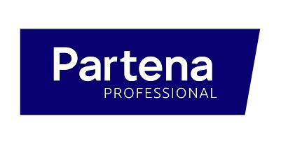

<!-- PROJECT LOGO -->
 

  
  

  <h1 align="center">Sectoral Document</h1>
  <h3 align="center">ATTENTION : CETTE PAGE A ÉTÉ CRÉÉE DE MANIÈRE ROBOTIQUE AVEC UN CODE AUTOMATIQUE VEUILLEZ FAIRE LES CHANGEMENTS NÉCESSAIRES ET CONFIRMER L'EXACTITUDE DES INFORMATIONS</h3>

## COMMISSION PARITAIRE AUXILIAIRE POUR EMPLOYÉS

Commission paritaire : 200.00

Dernier changement : 22/10/2020

* [THÈMES CONNEXES DANS TOUTES LES CLA(from 16 pdfs) :](#THÈMES CONNEXES DANS TOUTES LES CLA(from 16 pdfs) :)
* [CHAMP D'APPLICATION DE LA CLA :](#CHAMP D'APPLICATION DE LA CLA :)
* [CLA - DE QUOI š'AGIT-IL :](#CLA - DE QUOI š'AGIT-IL :)
* [SYSTÈME D'AUTOMATISATION](#SYSTÈME D'AUTOMATISATION)
* [NOTRE SYSTÈME DE DATABASE](#NOTRE SYSTÈME DE DATABASE)
* [SYSTÈME *** QnA NLP MODEL](#SYSTÈME *** QnA NLP MODEL)

## THÈMES CONNEXES DANS TOUTES LES CLA(from 16 pdfs) :

1 - SALAIRES
	CLA - 152.849

2 - PAIX SOCIALE
	CLA - 152.849

3 - GROUPES À RISQUE
	CLA - 149.885, 149.886, 152.851, 152.856

4 - DÉLÉGATION SYNDICALE
	CLA - 160.974

5 - PRIME DE FIN D'ANNÉE
	CLA - 152.849

6 - TRAVAIL À TEMPS PARTIEL
	CLA - 152.380

7 - TEMPS DE TRAVAIL EN HEURES
	CLA - 152.380

8 - FONDS DE SÉCURITÉ D'EXISTENCE
	CLA - 149.221, 149.885, 149.886, 152.856

9 - FLEXIBILITÉ DU TEMPS DE TRAVAIL
	CLA - 152.380

10- MODALITÉS DE LA DURÉE DE TRAVAIL
	CLA - 152.380
11- INDEMNITÉS POUR FRAIS DE DÉPLACEMENT
	CLA - 152.852, 157.721

12- FORMATION (EXCL. FORMATION SYNDICALE)
	CLA - 149.886, 152.850, 152.851, 159.780

13- PENSIONS COMPLÉMENTAIRES ET ASSURANCES GROUPES
	CLA - 152.849

14- REMBOURSEMENT DE FRAIS (HORS FRAIS DE DÉPLACEMENT)
	CLA - 149.886, 152.851

15- RÉGIME DE CHÔMAGE AVEC COMPLÉMENT D'ENTREPRISE (RCC)
	CLA - 152.849, 152.853, 152.854

16- CRÉDIT-TEMPS/DIMINUTION DE CARRIÈRE, EMPLOI FIN DE CARRIÈRE
	CLA - 152.855

17- FONCTIONNEMENT AU SEIN DE L'ENTREPRISE/DES ORGANES DE CONCERTATION
	CLA - 160.974

18- TRAVAILLEURS  GÉS-EXCL.PENSIONS COMPLÉ, PRÉPENSION(RCC), CRÉDIT-TEMPS
	CLA - 152.855

## CHAMP D'APPLICATION DE LA CLA :

PORTÉE : auto-écoles reconnues par les ministres régionaux compétents
	CLA - 152.380

AUCUNE PORTÉE : écoles de conduite accréditées qui sont des organisations qui ne poursuivent pas un objectif rentable
	CLA - 152.380

AUCUNE PORTÉE : les employés qui utilisent leurs propres moyens de transport et dont la rémunération brute annuelle dépasse 27 750 EUR
	CLA - 152.852, 157.721

## CLA - DE QUOI š'AGIT-IL :

149.221 - Modification de la convention collective de travail  du 1 avril 2015 conclue au sein de la  Commission paritaire auxiliaire pour employés  portant l'institution d'un fonds de sécurité  d'existence et en fixant ses statuts.

149.885 - Modification de la convention collective de travail  du 1 avril 2015 instituant un fonds de sécurité  d'existence et en fixant ses statuts.

149.886 - CONVENTION COLLECTIVE DE TRAVAIL DU  13 DÉCEMBRE 2018 CONCLUE AU SEIN DE  LA COMMISSION PARITAIRE AUXILIAIRE  POUR EMPLOYÉS CONCERNANT LA FORMATION

152.380 - Du 13 juin 2019  Convention collective de travail concernant le règlement de certaines dispositions en matière de  travail à temps partiel et de conditions salariales  dans les auto-écoles agréées

152.849 - DU 1 JUILLET 2019 CONCLUE AU SEIN DE  LA COMMISSION PARITAIRE AUXILIAIRE  CONCERNANT LE POUVOIR D'ACHAT  DANS LE CADRE DE L’AR DU 19 AVRIL  2019 PORTANT EXÉCUTION DE L'ART, 7  §1 DE LA LOI DU 26 JUILLET 1996  RELATIVE À LA PROMOTION DE

152.850 - DU 1FR JUILLET 2019 MODIFIANT LA  CONVENTION COLLECTIVE DE TRAVAIL DU  13 DÉCEMBRE 2018 CONCLUE AU SEIN DE  LA COMMISSION PARITAIRE AUXILIAIRE  POUR EMPLOYÉS CONCERNANT LA  FORMATION

152.851 - ERRATUM + DU 1ER JUILLET 2019 CONCLUE AU SEIN DE LA  COMMISSION PARITAIRE AUXILIAIRE POUR  EMPLOYÉS CONCERNANT LA FORMATION

152.852 - ERRATUM + Convention collective de travail du 1er juillet 2019 Intervention dans les frais de transport

152.853 - DU 1 JUILLET 2019 CONCLUE AU SEIN  DE LA COMMISSION PARITAIRE  AUXILIAIRE POUR LES EMPLOYÉS  RELATIVE AU REGIME DE CHOMAGE  AVEC COMPLEMENT D'ENTREPRISE EN  EXÉCUTION DE LA CCT N° 130, CCT N°  131, CCT N° 138, CCT N° 139, CCT N° 132  ET DE LA CCT N° 140 CONCLUES AU  SEIN DU CONSEIL NATIONAL DU  TRAVAIL

152.854 - DU 1 JUILLET 2019 CONCLUE AU SEIN DE LA COMMISSION PARITAIRE AUXILIAIRE POUR LES EMPLOYÉS RELATIVE AU REGIME DE CHOMAGE AVEC COMPLEMENT D'ENTREPRISE EN EXÉCUTION DE LA CCT W 134, CCT W 135, CCT N° 
141 ET DE LA CCT W 142 CONCLUES AU SEIN DU CONSEIL NATIONAL DU TRAVAIL

152.855 - ERRATUM + CONVENTION COLLECTIVE DE TRAVAIL DU 1 JUILLET 2019 RELATIVE AU CRÉDIT-TEMPS

152.856 - Convention collective de travail du 1 juillet 2019 Modification de la convention collective de travail du 1 er avril 2015 conclue au sein de la Commission paritaire auxiliaire pour employés portant l'institution d'un fonds de sécurité d'existence et en fixant ses statuts.

157.721 - ERRATUM + Convention collective de travail du 16 janvier 2020 Intervention dans les frais de transport

159.780 - Convention collective du travail du 9 juillet 2020 modifiant la convention collective du travail du 9 juin 2016 relatif au statut de la délégation syndicale

160.974 - ERRATUM + Convention collective du travail du 9 juillet 2020 modifiant la convention collective du travail du 1er juillet 2019 concernant la formation

161.876 - Convention collective du travail du 8 octobre 2020 modifiant la convention collective du travail du 1 juillet 2019 concernant la formation

## SYSTÈME D'AUTOMATISATION

LES TABLES + LISTES + LES DONNÉES DEMANDÉES PEUVENT ÊTRE AJOUTÉES À CETTE PAGE EN FAISANT DE PETITS CHANGEMENTS DANS LE SYSTÈME D'AUTOMATISATION EXISTANT

## NOTRE SYSTÈME DE DATABASE

REMARQUE: LES INFORMATIONS DÉTAILLÉES SUR LES FICHIERS CLA PEUVENT ÊTRE EXAMINÉES À L'AIDE DE L'APPLICATION D'INTERFACE UTILISATEUR PAR LA PUISSANCE DE 
NOTRE SYSTÈME DE DATABASE

## SYSTÈME *** QnA NLP MODEL

DE PLUS, DES RÉPONSES À CHAQUE QUESTION PEUVENT ÊTRE TROUVÉES EN UTILISANT LE SYSTÈME *** QnA NLP MODEL *** 

